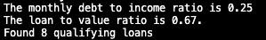

# **Loan Qualifier**

This Loan Qualifier application provides a list of lenders who offer loans meeting the user provided criteria.  The applicant is prompted to enter basic loan & personal information.  Once entered, this application returns a list of qualifying loans and asks the user if they would like to save the list to a CSV file.

---

# **Technologies**

This application is a CLI application and leverages the questionary and fire libraries for user interaction.

---

# **Installation Guide**

Before running the application you need to install the following dependencies:
```python
conda install -c conda-forge questionary
conda install -c conda-forge fire
```

---

# **Usage**
User prompted for the following input:


Application responds with the following output:



Finally, the user is asked to confirm if they would like to save the results to a CSV file:


---

# **Contributors**

Developed by:

Matthew Crater

[Linked In](https://www.linkedin.com/in/matt-crater/)

---

# **License**

MIT
